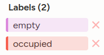
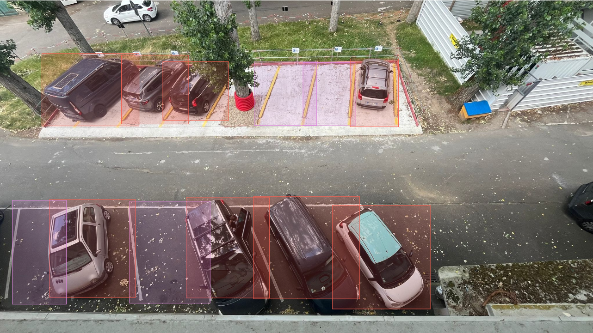

# SYOTAME_data

# Introduction
The SYOTAME project is a project to create an application allowing user to reserve a parking spot, from partner parking.  
This git repository is the data portion of this project. With everything concerning the computer vision model used for this application.  

# Data
For the data used to fine-tuned this model, we used multiple Roboflow dataset as well as our own dataset. For our own dataset we created it via picture of the parking we initialy wanted to use.  

## Personalized dataset
After multiple test of model, we decided to create our own dataset with real picture of the parking we wanted to use.  

1. First we took about 100 picture with different light, angles and time of day.  
  
2. Then we had to annotated every pictures by adding bounding boxes. For that step we used [humansignal.com](https://app.humansignal.com/). This website gave us the possiblity to easily mark every picture with bounding boxes. We created 2 labels (empty and occupied), to match the dataset we got from RoboFlow.  

  
3. After we annoted, by hand, every picture took.

    Purple for empty and red for occupied.  
      
4. Finaly we split the dataset between train and validation. To do that we used a function from a [git repository](https://raw.githubusercontent.com/EdjeElectronics/Train-and-Deploy-YOLO-Models/refs/heads/main/utils/train_val_split.py). We choos to have 90% of picture in train dataset and 10% of picture in validation dataset.  

After doing all of that with merged this personalizaned dataset with the 3 we found on Roboflow.

# Model
For our model we used google colab to train it. Like that we had access to faster GPU to improve the traning time needed for our model.  
We created an object detection model, fine-tuning a yolo model.  
To have the best possible model we train multiple model using different dataset. In total we train 3 models with 3 different dataset :  
1. With PKLot dataset, using yolov5
2. With 3 Roboflow dataset using yolov8
3. With 3 Roboflow dataset + our personalized dataset, using yolov8